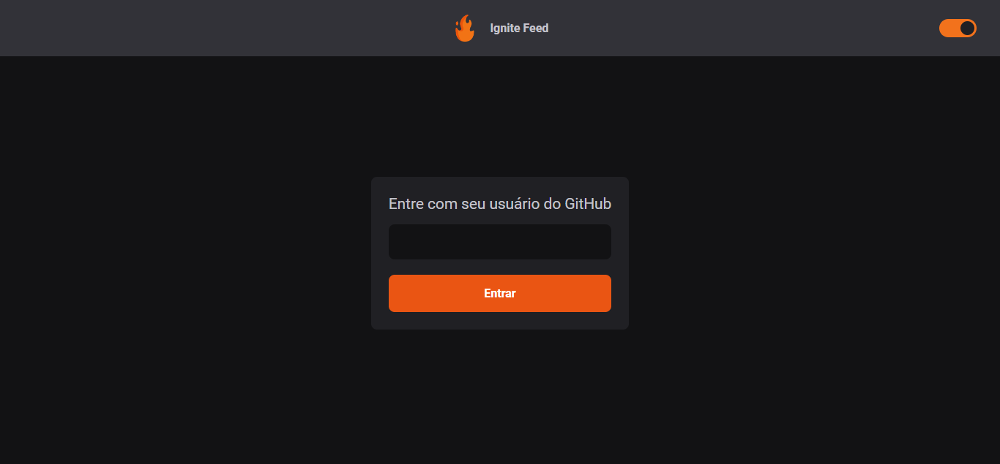
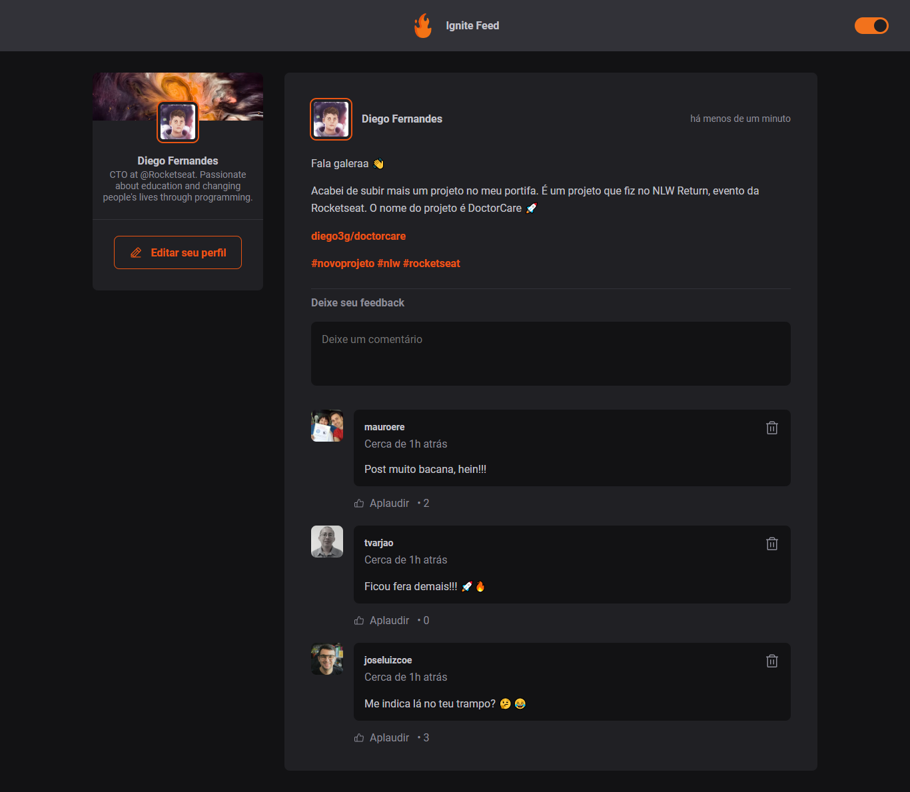

# Ignite Feed 🔥

## [check out the app](https://ignite-feed-gules.vercel.app/)

This app was based on the Rocketsear project 🚀 [Ignite feed](https://www.figma.com/community/file/1113573231685349036), during the New Track React Fundamentals Module.

However, I decided to give the app a "my face", making both a theming system and consuming a public GitHub API for a better user interactivity.

### Login screen

The login screen is composed of just one input where you must put your github user login to continue.

### Feed

The main feed screen contains information about the logged in user, as well as a post from the logged in user. Below the post are comments from his followers on Github.

